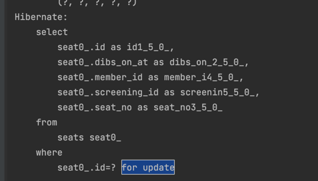

# 동시성 제어 연습을 위한 프로젝트

영화관 좌석 찜, 이벤트 응모 두 가지 문제를 각기 다른 동시성 제어 방법을 통해 해결합니다. 

- 영화관 자석 찜 

영화관에서 상영되는 영화의 좌석을 예매하기 위해 사용자는 먼저 찜을 할 수 있습니다. 가장 먼저 찜한 사용자는 10분동안 찜 상태가 유지되며, 다른 사용자는 찜한 좌석에 찜을 할 수 없습니다. 

여러 명이 동시에 찜을 시도할 떄 최초 찜한 사용자 말고 나머지 사용자는 오류처리가 될 수 있도록 동시성 제어가 필요합니다. 

이 문제를 해결하기 위해서 JPA의 Pessimistic Lock (비관적 잠금)을 활용합니다. 선점잠금이라고도 불리는 이 기능은, 트랜잭션 끼리 충돌이 발생한다고 가정하고 우선 락을 거는 방법입니다. 

실제로 로직에 대한 테스트를 실행시켜보면 Database의 락을 거는 방법인 for update를 활용함을 알 수 있습니다. 

- 이벤트 응모

이벤트에는 최대 응모 인원이 정해져있습니다. 데이터베이스에는 이벤트의 최대 응모 인원만큼 사용자가 등록되어야 합니다. 동시성 제어가 없다면 여러명의 사용자가 동시에 이벤트 응모 신청을 했을 때 정확한 최대 응모 인원을 보장하기 어렵습니다. 

이 문제를 해결하기 위해서 여기서는 레디스를 활용한 분산 락을 활용합니다. 영화관 좌석 찜에 사용된 Pessimistic Lock과는 어떻게 다를까요? 레디스를 활용 한 분산 락은 데이터베이스에서 제공하는 lock 메커니즘이 아닌 싱글 스레드 기반의 레디스의 특징을 활용합니다. 
만약 서비스의 데이터베이스가 분산 DB 환경이라면, 앞서 말한 Pessimistic Lock으로는 문제 해결하기가 어렵지만 레디스를 활용한 분산락 메커니즘으로는 해결이 가능합니다.

레디스를 활용한 분산 락 방식을 구현하기 위해서 자바용 레디스 클라이언트에 대해서 먼저 알아야 합니다. 

1. Lettuce

Lettuce를 스핀락 방식으로 동작합니다. 스핀 락은 락이 없는 프로세스가 Lock을 획득할 떄 까지 무한 루프를 도는 방식입니다. 필연적으로 CPU를 낭비할 수 밖에 없기 떄문에 성능 저하로 이루어질 수 있습니다. 

2. Redisson

스핀락을 방식이 아닌 pubsub방식을 활용합니다. 즉 레디스에서 락을 기다리는 클라이언트에게 락을 획득할 수 있다는 메시지를 보내주는 방식입니다.

이벤트 응모 기능은 Redission 클라이언트를 활용하여 분산 락을 구현하였습니다. 